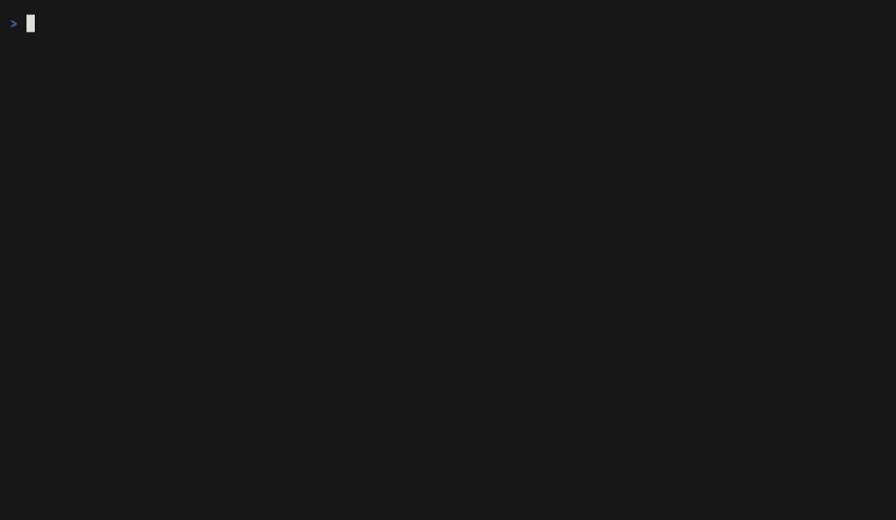

# Network Doctor

[](https://github.com/heymaikol/network-doctor/actions/workflows/ci.yml)
[](https://github.com/heymaikol/network-doctor/releases/latest)
[](LICENSE)
[](https://heymaikol.github.io/network-doctor/)

**Find the layer where your connection breaks.** Network Doctor is a
cross-platform network troubleshooting TUI that turns interface, DNS, TCP,
TLS, HTTP, proxy, and path-MTU checks into one plain-English diagnosis.



Instead of handing you a wall of `ping`, `dig`, and `curl` output, Network
Doctor answers the useful question: **is the problem on my network, along the
path, or at the service?**

## Why Network Doctor

- **Isolates the failing layer.** Independent probes distinguish local-link,
  DNS, egress, target, TLS, HTTP, proxy, and path-MTU failures, and say so when
  the evidence stops short of naming one.
- **Explains what to do next.** Results include evidence and targeted fix hints,
  with familiar drill-down tools one keypress away.
- **Needs no root access.** Even the path-MTU check and LAN map use unprivileged
  sockets and bounded probes.
- **Works interactively or in automation.** Use the TUI for live investigation,
  `--watch` for intermittent faults, or stable JSON and exit codes in scripts.
- **Runs everywhere.** The same diagnosis engine supports Linux, macOS, and
  Windows, with native packages and prebuilt binaries.

## Quick start

Install `netdoc` using the package for your platform below, then diagnose any
host or service:

```sh
netdoc github.com       # DNS → TCP → TLS → HTTP diagnosis
netdoc github.com:22    # SSH path and banner diagnosis
netdoc --profile github # GitHub web, API, and both SSH paths
netdoc --profile ssh server.example.com # SSH path, route, MTU, and banner evidence
netdoc --watch host     # catch intermittent failures
netdoc --json host      # structured report for scripts or bug reports
netdoc --peer-listen 192.168.1.20:4242  # offer one direct, authenticated peer session
netdoc --peer-connect   # paste the temporary pairing string at the hidden prompt
netdoc --two-sided --via ideapad example.com  # local and remote: where is the failure?
netdoc --two-sided here.ndoc there.ndoc  # two machines, one target: which side is it on?
```

Run `netdoc` with no target to check the local interface, internet egress,
configured proxy, public DNS, and Wi-Fi metadata. A finished run leads with the
answer: the verdict, the fix, the tool worth reaching for next, and the one line
of evidence the verdict rests on, above the checks that produced them. When a
target's path broke, a one-line target path sits under that answer, showing the
rung that failed and the checks that never ran behind it. Select any other row
to see its own evidence and suggested fix. Press `e` to replace the focused
Details panel with the causal explanation for the diagnosis, and `?` for every
shortcut.

In `--watch`, Network Doctor keeps a bounded incident timeline around each
intermittent failure. It retains the last working state, the failure onset,
meaningful changes while the failure continues, and the first recovered state.
Press `i` after an incident appears to inspect what changed at onset and
recovery, the diagnosis and its causal evidence, or save the selected incident
as a portable `.ndoc` with `w`.

## Service profiles

A service profile composes ordinary `netdoc target` runs into one service-specific check with a single aggregate verdict, and every component keeps its full ordinary report and causal evidence:

```sh
netdoc --profile list                   # the built-ins
netdoc --profile github                 # GitHub web, API, and both SSH paths
netdoc --profile ssh server.example.com # port 22 by default, with banner evidence
```

The built-ins are `github`, `ssh`, `smtp`, and `web`. Profiles are headless: `--json`, `--save`, and `--support` behave as they always do, and `--via` runs each component on the SSH host. The per-plan endpoints, the aggregate rules, and the execution modes are in **[docs/reference.md](docs/reference.md#service-profiles)**.

## Contribute

Network Doctor actively welcomes external contributors, and many contributions
need no networking expertise. Useful work includes Go and Bubble Tea / TUI
development, Bash, Zsh, and Fish completions, CI / packaging / release tooling,
documentation, Linux / macOS / Windows testing, and real-network field testing.

Pick up something to start on:

- [Good first issues](https://github.com/heymaikol/network-doctor/issues?q=is:issue+is:open+label:%22good+first+issue%22)
- [Help wanted issues](https://github.com/heymaikol/network-doctor/issues?q=is:issue+is:open+label:%22help+wanted%22)

Read [CONTRIBUTING.md](CONTRIBUTING.md) for setup, choosing a task, validation,
and opening a pull request.

## Install

Runs on **Linux, macOS, and Windows**. Project = `network-doctor`; installed binary = `netdoc`.

### Windows

Scoop, from own bucket:

```powershell
scoop bucket add heymaikol https://github.com/heymaikol/scoop-bucket
scoop install network-doctor
```

A release reaches the bucket as soon as it publishes, so `scoop update network-doctor` picks it up like any other app.

### macOS and Linux (Homebrew)

```sh
brew install network-doctor
```

The Homebrew Core formula, bottled for both platforms, so `brew upgrade` picks up releases like any other formula. It installs `netdoc` alone; for `netdoc-sim` too, take a [Linux package](#linux).

### Linux

#### Fedora

**Fedora stable uses the prebuilt release RPM. Fedora Rawhide uses COPR.**

##### Fedora stable: prebuilt release RPM

Download the `.rpm` for your architecture from the [latest release](https://github.com/heymaikol/network-doctor/releases/latest), then install it locally:

```sh
sudo dnf install ./network-doctor_X.Y.Z_linux_ARCH.rpm    # ARCH is amd64 or arm64
```

The release RPM is prebuilt, so the Go-version limitation that prevents COPR
source builds on Fedora 43, 44, and 45 does not apply. It is a standalone
package: installing it does not add a Network Doctor repository, and `dnf`
will not automatically pull the next release.

##### Fedora Rawhide: COPR repository

The [COPR repo](https://copr.fedorainfracloud.org/coprs/heymaikol/network-doctor/)
builds from source and publishes only for Fedora Rawhide on `x86_64` and
`aarch64`:

```sh
sudo dnf copr enable heymaikol/network-doctor
sudo dnf install network-doctor
```

This repository-backed install upgrades normally through `dnf`. A new COPR
package appears after its Rawhide builds finish, so it may trail the GitHub
release. COPR signs with its own per-project key, a separate trust root from
the GitHub attestation below, which `dnf copr enable` installs for you.

#### Other Linux distributions

Prebuilt `.deb`, `.rpm`, and `.apk` packages are on the [latest release](https://github.com/heymaikol/network-doctor/releases/latest), for `amd64` and `arm64`. Download one and install it locally:

```sh
sudo apt install ./network-doctor_X.Y.Z_linux_amd64.deb    # Debian, Ubuntu, Mint
sudo dnf install ./network-doctor_X.Y.Z_linux_amd64.rpm    # RHEL, Rocky, Alma
sudo apk add --allow-untrusted ./network-doctor_X.Y.Z_linux_amd64.apk    # Alpine
```

These standalone packages do not add an update repository, so `dnf`/`apt`
will not pull the next version for you. After downloading a newer Debian
package, install it over the existing version and confirm the upgrade:

```sh
sudo apt install ./network-doctor_X.Y.Z_linux_amd64.deb
netdoc --version
netdoc-sim version
dpkg-query -W network-doctor
```

Every Linux package (COPR, `.deb`, `.rpm`, `.apk`) installs two commands at the same version: `netdoc`, and `netdoc-sim`, the simulator behind [Challenge Mode](#think-you-can-beat-network-doctor). Confirm both:

```sh
netdoc --version
netdoc-sim help
```

`netdoc-sim` is Linux-only: it builds its networks out of Linux namespaces, so the macOS and Windows downloads ship `netdoc` alone. Those hosts run the same simulator from [a container](docs/simulation.md#running-it-in-a-container) instead.

### Everywhere else

Grab a prebuilt binary from the [latest release](https://github.com/heymaikol/network-doctor/releases/latest) (Windows ships as a `.zip`, the rest as bare binaries), or install with Go 1.27+:

```sh
go install github.com/heymaikol/network-doctor/cmd/netdoc@latest
```

Check what you are running with `netdoc --version`.

Or build from clone:

```sh
git clone https://github.com/heymaikol/network-doctor
cd network-doctor
go build -o netdoc .
```

### Verify your download

Releases carry a signed attestation binding each artifact to the workflow run that built it (not available for v1.8.4 and earlier). With the GitHub CLI installed and `gh auth login` done:

```sh
VERSION=X.Y.Z
gh attestation verify "./netdoc_${VERSION}_linux_amd64" \
  --repo heymaikol/network-doctor \
  --signer-workflow heymaikol/network-doctor/.github/workflows/release.yml
```

This proves the bytes were built from the tagged commit by the release workflow. The source tarball, the `.deb`/`.rpm`/`.apk` packages, and the Windows `.zip` are attested too, so pass whichever filename you downloaded. The vendored-dependency tarball (`*-vendor.tar.gz`, which lets COPR build offline) is attested as well; COPR packages themselves are rebuilt on Fedora's own builders and carry COPR's signature instead.

## How it diagnoses

Probes form a **dependency graph with independent branches**, so an unrelated failure never hides a working one: direct egress, QUIC, proxy egress, public and encrypted DNS, and the selected target path each run on their own, and the unprivileged path-MTU check hangs off the connect. Each row lands in one of five states, **✓ Pass**, **! Warn**, **✗ Fail**, **⊘ Skip**, and **– N/A**; Warn never counts as a failure.

The full probe table with exact pass conditions, JSON causes, and the unprivileged path-MTU method is in **[docs/reference.md](docs/reference.md#how-it-diagnoses)**. The wiki's [How Network Doctor Works](https://github.com/heymaikol/network-doctor/wiki/How-Network-Doctor-Works) explains why the branches are independent, and [Understanding Your Diagnosis](https://github.com/heymaikol/network-doctor/wiki/Understanding-Your-Diagnosis) turns a row into a next action.

## Think you can beat Network Doctor?

Challenge Mode drops you into a deliberately broken network without telling you what's wrong, then lets Network Doctor take a shot at the exact same problem, with both graded against the simulator's independently observed ground truth. There's a daily challenge, and everybody who plays that day gets the same broken network:

```sh
netdoc-sim challenge -daily   # today's, the same one for everybody
netdoc-sim challenge -id V4-8F42C1   # replay the one a friend sent you
```

It ends with a result you can post, and `-daily` puts it on your clipboard. On macOS, Windows, or Linux, one container image is the whole install:

```sh
docker run --rm -it --cap-add SYS_ADMIN ghcr.io/heymaikol/netdoc-sim:latest challenge -daily
```

On Linux, any [package](#linux) installs `netdoc-sim` natively. Everything is local and reproducible: no account, no server, no leaderboard, and a challenge id is the whole puzzle. See the wiki's [Challenge Mode](https://github.com/heymaikol/network-doctor/wiki/Challenge-Mode) for the full walkthrough, and **[docs/simulation-challenge.md](docs/simulation-challenge.md)** for the contract behind scoring.

## Usage

```sh
netdoc                  # generic local + internet diagnosis
netdoc github.com       # diagnose the path to a host (→ HTTP + TLS + HTTPS)
netdoc github.com:22    # port selects the protocol rows (→ SSH banner)
netdoc https://host:80  # explicit scheme selects the protocol (→ TLS + HTTPS on :80)
netdoc ssh://host:2222  # explicit scheme keeps SSH on a nonstandard port
netdoc --json host      # headless: one JSON report on stdout (scripts, CI, bug reports)
netdoc --save incident.ndoc host  # headless: save the finished run as a snapshot file
netdoc --support support.ndoc host  # headless: save a sanitized snapshot for sharing
netdoc --compare good.ndoc bad.ndoc  # headless: report what changed between two snapshots
netdoc --watch host     # TUI: re-run continuously and track intermittent failures
netdoc --json --watch host  # headless: one JSON report per line, until interrupted
netdoc --list-checks        # list the stable IDs accepted by --check and --skip
netdoc --check dns,target_tcp,tls example.com  # run only these IDs and their prerequisites
netdoc --skip internet_tcp,quic_udp_443 example.com  # omit these probe branches
netdoc --no-reference-egress host  # reach only the target and this machine's own network config
netdoc --via server host  # run the checks on an SSH host and show the result here
netdoc --two-sided --via server host  # run here and there, then localize the difference
netdoc --iface wg0 host # bind probe traffic to wg0's source address
netdoc --public-dns 9.9.9.9 host  # take the second opinion from Quad9 instead
netdoc --no-history host          # don't read or save the target history file
netdoc --peer-listen 192.168.1.20:4242  # wait for one directly reachable peer
netdoc --peer-connect             # paste its temporary pairing string when prompted
netdoc --two-sided here.ndoc there.ndoc  # which machine a failure belongs to
```

`--timeout` overrides the per-check probe timeout. `--list-checks` prints the stable IDs and names accepted by `--check`/`--skip`; those selectors choose probes by stable ID plus their dependency closure. `--no-reference-egress` drops every check that would contact netdoc's own reference services, leaving the target and an explicitly selected profile's endpoints as the only destinations, reached through this machine's own resolver and routing; `--iface` and address-only binding follow probe traffic through the drill-down tools too. Full flag semantics, the target-parsing rules, the TUI key table, the Actions menu, themes, and the history file are in **[docs/reference.md](docs/reference.md#usage-details)**.

## Drill-down tools

Each diagnosis row is *evidence*; when you want proof, run the real tools as cancellable streaming jobs, several at once, with `tab` switching between the live ones and output sanitized before it hits your terminal: `I`, `s`, `p`, `d`, `c`, `t`, `m`, and `n` run the OS's route, socket, ping, DNS, curl, traceroute, mtr, and nmap tools against the current target, `v` maps the local private network, and `S` opens a full interactive SSH login to it. Review your local copy before sharing, since tool evidence may contain sensitive data.

The per-OS command table, binding rules, `--toolbox`, the LAN map flow, and the SSH login details are in **[docs/reference.md](docs/reference.md#drill-down-tools)** and **[SSH login](docs/reference.md#ssh-login)**.

### JSON output

`--json` runs the same probe DAG headless and prints one JSON document to stdout. `status` is one of `PASS`, `WARN`, `FAIL`, `SKIP`, `N/A`, and `verdict` is the class a script actually asks about: `ok`, `degraded`, `dns`, `network`, `service`, or `incomplete`. Field names and the status vocabulary are stable, so they are safe to script against.

The full field reference, including `cause` values and the verdict table, is in **[docs/reference.md](docs/reference.md#json-output)**.

### Diagnostic snapshots

`--save file` runs the checks headless and writes the finished run to a versioned `.ndoc`, for the failure you cannot reproduce on demand; it never changes the diagnosis or the exit code, and combines with `--json`. `--support file` writes the same artifact pseudonymized for sharing, with an explicit redaction map; inspect it before sharing a sensitive environment.

The format, the contents, the Watch Mode incident variant, and the full support policy are in **[docs/reference.md](docs/reference.md#diagnostic-snapshots)** and **[Support snapshots](docs/reference.md#support-snapshots)**.

### Comparing two snapshots

`--compare good.ndoc bad.ndoc` reports what changed between two saved runs. It runs no probes and opens no socket, so it works long after the fact, on a machine that has never seen either network. The comparison is semantic rather than a JSON diff, and it exits `0` when the runs describe the same state and `1` when they do not, so it is usable as a question in a script.

The ignored fields, ordering, version compatibility, and different-target behavior are in **[docs/reference.md](docs/reference.md#comparing-two-snapshots)**.

### Remote diagnosis over SSH

`--via server host` runs the checks on another machine and presents the finished diagnosis here, for the machine whose network is broken in a way you cannot reproduce on yours. Add `--two-sided` to run the same target locally and remotely at the same time, then localize their completed snapshots with the ordinary two-sided engine. The destination goes to your own `ssh` client exactly as typed, so `~/.ssh/config` aliases, `user@host`, ports, and agent authentication all behave the way they do for `ssh server`, and netdoc installs nothing on the far end.

A remote network that fails a check exits `1`, exactly as a local one does; a broken SSH connection, a missing remote `netdoc`, or a remote protocol mismatch exits `2` and says which it was, so a broken network is never confused with a broken connection.

The protocol, exit codes, and limits are in **[docs/reference.md](docs/reference.md#remote-diagnosis-over-ssh)**.

### Two-ended peer diagnosis

Peer mode compares independently observed traffic in both directions instead of running the ordinary report twice: on the machine that can accept a direct connection, bind an exact address with `--peer-listen`, and paste the printed temporary pairing string into `--peer-connect` on the other machine. Each session uses a fresh pinned TLS 1.3 certificate and an expiring pairing string, and the reports never contain the token or pin.

There is no relay, account, or NAT traversal: at least one advertised listener address must be directly reachable.

The full security, privacy, protocol, and diagnosis contract is in **[docs/reference.md](docs/reference.md#peer-diagnosis)**.

### Two-sided diagnosis

Peer mode answers the path directly between two Network Doctor machines. Two-sided diagnosis asks why the same external target behaves differently from their two vantage points. The live form starts both ordinary runs together, with this machine as side A and the SSH destination as side B:

```sh
netdoc --two-sided --via other-host github.com
netdoc --two-sided --via other-host --json github.com
```

The artifact form remains offline and network-free:

```sh
netdoc --save here.ndoc github.com                     # this machine
netdoc --via other-host --save there.ndoc github.com   # the other machine
netdoc --two-sided here.ndoc there.ndoc                # where is it broken?
```

Both forms use the same canonical snapshots, conservative localization, and `netdoc.twosided.v1` JSON schema. They place the failure on the vantage point where it is specific, report every caveat they cannot rule out, and make no claim about any device in between. `--compare` instead asks what changed between two saved states, while peer mode measures direct authenticated traffic between the Network Doctor endpoints.

What a placement does and does not prove, and how the three two-machine commands divide the work, are in **[docs/reference.md](docs/reference.md#two-sided-diagnosis)**.

### Exit codes

`0` is a completed run with nothing failed, `1` is a failed or incomplete run, and `2` is a run that could not happen: bad arguments, a rejected pairing input, or a `--via` connection that never opened. The full table, per command, is in **[docs/reference.md](docs/reference.md#exit-codes)**.

```sh
netdoc github.com || echo "path to github is broken"
```

## Platform support

All probes, the diagnosis engine, and the TUI are pure Go and identical on Linux, macOS, and Windows. Platform-specific garnish (the default gateway, the Wi-Fi SSID) degrades to empty rather than failing the probe when the OS lookup fails.

`netdoc-sim` and Challenge Mode are the exception: their backend is Linux namespaces and there is no other one, so macOS and Windows run [the published image](docs/simulation.md#running-it-in-a-container) on a Linux container runtime rather than a port. `netdoc` itself needs no container anywhere.

## Documentation

The **[wiki](https://github.com/heymaikol/network-doctor/wiki)** is the primary user-facing hub for how to use `netdoc` and what a diagnosis means; **[docs/reference.md](docs/reference.md)** is the full technical reference for exact CLI semantics, keybindings, exit codes, and schemas. Both are published at **[heymaikol.github.io/network-doctor](https://heymaikol.github.io/network-doctor/)**:

- [Getting Started](https://heymaikol.github.io/network-doctor/wiki/Getting-Started/): install, first run, and what the screen is showing you.
- [Understanding Your Diagnosis](https://heymaikol.github.io/network-doctor/wiki/Understanding-Your-Diagnosis/): turning a verdict into a next action, including telling "my network" and "their service" apart.
- [How Network Doctor Works](https://heymaikol.github.io/network-doctor/wiki/How-Network-Doctor-Works/): why the probe branches are independent, and how path MTU is measured without root.
- [Troubleshooting and FAQ](https://heymaikol.github.io/network-doctor/wiki/Troubleshooting-and-FAQ/): the rows that behave surprisingly, and the questions that come up most.
- [Reference](https://heymaikol.github.io/network-doctor/docs/reference/) and the [simulator guide](https://heymaikol.github.io/network-doctor/docs/simulation/): the same `docs/` files that live beside the code.

The site is built from `docs/` and the wiki, so each page is still edited exactly where it lives; nothing is duplicated to publish it.

## Feature summary

Native DAG probes + diagnosis engine + authenticated two-ended peer diagnosis, built-in service profiles (`--profile`), two-pane UI, concurrent cancellable streaming tool jobs (`ping`/`dig`/`curl`/`traceroute`/`mtr`/`ss`/`ip`/`nmap`) + filterable output viewer + `--toolbox` mode, `Warn` state, proxy-aware diagnosis, unprivileged path-MTU check, public-DNS second opinion, LAN network map with per-device service selection, `S` SSH login, source-interface pinning (`--iface`), probe selection (`--check`/`--skip`), `--watch` with bounded incident reconstruction, TUI history strips and `--json` NDJSON, `--json` output, portable `.ndoc` diagnostic snapshots (`--save`), sanitized support snapshots (`--support`), semantic snapshot comparison (`--compare`), saved and live local-vs-remote two-sided localization (`--two-sided`), remote diagnosis over SSH (`--via`), report copy/save.

## Built with

[Bubble Tea](https://github.com/charmbracelet/bubbletea),
[Bubbles](https://github.com/charmbracelet/bubbles), and
[Lip Gloss](https://github.com/charmbracelet/lipgloss).

## Contributing

Bug reports, focused pull requests, and platform testing are welcome. Please
report suspected vulnerabilities privately as described in
[SECURITY.md](SECURITY.md).

## Support

### Personal Network Diagnosis

Still stuck after running Network Doctor? I offer
[Personal Network Diagnosis](https://tally.so/r/KYK7Y7) for one networking
problem. Send a description, relevant context, and a sanitized report created
locally with `netdoc --support support.ndoc example.com`, or omit the target for
a general connectivity problem. Network Doctor does not upload the file.

I personally investigate the evidence and send a written diagnosis of the
likely cause, concrete troubleshooting steps to try next, and one follow-up
reply. The introductory price is **$25 USD as a one-time payment, limited to the
first 5 cases**. This is diagnostic assistance, not a guarantee of repair.

### GitHub Sponsors

Network Doctor is free software maintained independently. If it saves you time,
you can [sponsor its development](https://github.com/sponsors/heymaikol). Your
support helps fund the time spent on cross-platform testing, packaging, releases,
and ongoing maintenance. Sponsorship is optional and does not affect access to
the software or how issues are prioritized.

## Tests

For an ordinary, focused pull request, run the tests nearest your change plus
`go test ./...`, then any additional checks clearly relevant to the files or
behavior you changed. That is almost all a small external contribution needs.
The exhaustive gate below exists for CI, maintainership, releases, and the
specific checks that apply to your change; a small contribution does not have
to reproduce every CI environment locally.

The core Go checks run directly, and external validation tools use pinned
`go run` commands, so a Go toolchain is the only prerequisite:

```sh
go vet ./...
CGO_ENABLED=0 go build ./...
go test ./...
go test -tags integration ./internal/diagnostic ./internal/peer ./internal/simulation
go test -tags acceptance -count=1 -run '^TestNative' . ./internal/ui
go test -tags netns_integration -count=1 -v ./internal/simulation
go test -race ./...
go test -race -tags integration ./internal/diagnostic ./internal/peer ./internal/simulation
go test -fuzz=FuzzSanitize -fuzztime=10s ./internal/textsafe
go test -fuzz=FuzzEncryptedDNSResponseVerifier -fuzztime=10s ./internal/diagnostic
go test -fuzz=FuzzParseTarget -fuzztime=10s ./internal/diagnostic
go test -fuzz=FuzzDecodeMessage -fuzztime=10s ./internal/peer
go test -fuzz=FuzzGenerateHuntCase -fuzztime=10s ./internal/simulation
go run github.com/golangci/golangci-lint/v2/cmd/golangci-lint@v2.13.1 run ./...
go run golang.org/x/vuln/cmd/govulncheck@v1.6.0 ./...
go run github.com/goreleaser/goreleaser/v2@v2.17.1 check
```

If the change touched the `Dockerfile` or the image's release job, also build the
image and test the artifact. It needs Docker or Podman, which is why it is not in
the gate above:

```sh
docker build --build-arg VERSION=dev -t netdoc-sim:test .
NETDOC_CONTAINER_IMAGE=netdoc-sim:test go test -tags container -count=1 -v .
```

If the change touched `docs/`, `site/`, or `cmd/docsite`, also build the
documentation site the way [the pages workflow](.github/workflows/pages.yml)
does. It needs the wiki checkout and the same container image GitHub Pages
builds with, which is why it is not in the gate above:

```sh
git clone --depth 1 https://github.com/heymaikol/network-doctor.wiki.git ../network-doctor.wiki
go run ./cmd/docsite -wiki ../network-doctor.wiki -out _docsite
docker run --rm -v "$PWD":/gh -e GITHUB_WORKSPACE=/gh \
  -e INPUT_SOURCE=_docsite -e INPUT_DESTINATION=_site \
  -e GITHUB_REPOSITORY=heymaikol/network-doctor \
  ghcr.io/actions/jekyll-build-pages:v1.0.13
go run ./cmd/docsite -verify _site
```

If the change touched a build-tagged or `_linux`/`_darwin`/`_windows` suffixed
file, also compile for macOS and Windows:

```sh
GOOS=darwin go build ./...
GOOS=windows go build ./...
```

Race, fuzz, and network-namespace checks run only on Linux in CI. The
`netns_integration` tests skip themselves on a host without unprivileged user
namespaces; they never need root. That gate keeps `-v` because a skipped run and
a real one both print just `ok` otherwise, and `-count=1` because a cached
result would not have exercised any namespace at all.

The `acceptance` command has tests only on macOS and Windows, and CI runs it on
both native hosts. It builds the release-shaped `netdoc` and holds its native
route evidence to observations the binary did not produce: the source address
the kernel selects for a connected datagram socket, and the platform's own route
tool, `Find-NetRoute` on Windows and `/sbin/route` on macOS. It also exercises
loopback and the built-in route, socket, and ping drill-down commands. The route
oracles send no application data: a route lookup and a connected UDP socket are
local decisions, while the drill-down checks stay on loopback. It keeps
`-count=1` so a cached result can never stand in for a run that actually touched
the host.

One acceptance test is opt-in, because no hosted runner has the topology it
needs. `TestNativePreparedTargetRouteMatchesTheHostRouteTool` checks the route
evidence netdoc publishes for a user-supplied target against the platform's own
route tool on a host where a route narrower than the default covers that target
and leaves by a different interface, which is how a split tunnel or a lab route
over a second adapter looks. Set `NETDOC_ACCEPTANCE_TARGET` to the destination
as an IP literal (`10.20.0.5`, `10.20.0.5:443` or `[2001:db8::5]:443`; a
hostname is rejected, so no resolver picks which route is under test), and
nothing needs to listen on it. Without the variable the test skips, while a
variable that is present but empty fails, so a job whose value expanded to
nothing hears about it; set `NETDOC_REQUIRE_ACCEPTANCE_TARGET=1` to turn the
remaining skip into a failure too, so a job meant to run it cannot go green
having skipped it. Once opted in, a host that is not actually in that shape
fails rather than skips. The test only observes: it reads routes and opens a
connected datagram socket, and never creates, changes, or removes a route,
interface, tunnel, address, or firewall rule. Preparing that state is a manual
step on a real machine, so CI sets neither variable.

Three layers of evidence sit behind a release, and none of them substitutes for
another:

- **Deterministic tests and the Linux namespace simulator** prove the diagnosis
  engine against controlled topologies. They prove nothing about whether the
  Windows or macOS adapter reads its own operating system correctly.
- **Native macOS and Windows acceptance** proves that reading, for the semantics
  a GitHub-hosted runner genuinely exposes: route existence, the selected
  interface, the IPv4 source address where the native API supplies it, IPv6
  source ownership, the next hop, and the matched route entry. Windows also
  checks the source and interface index/alias reported by `Find-NetRoute`. A
  runner with no real tunnel cannot
  prove VPN classification, so acceptance checks only that the native adapter
  populated a structurally valid link classification.
- **Field validation on real networks** is the only evidence for what CI cannot
  manufacture: a real VPN tunnel, a captive portal, split DNS under enterprise
  or VPN routing policy, an IPv6-only or DNS64/NAT64 network, live LAN DNS-SD
  devices, and a managed proxy-only network. Those stay open as field-validation
  issues, and a green CI run never closes one.

## Development

The package layout and the dependency rules between the packages are documented
in [CONTRIBUTING.md](CONTRIBUTING.md#development).

## License

Network Doctor is licensed under the [Apache License, Version 2.0](LICENSE). Package metadata declares this as `Apache-2.0`.

## Star History

<a href="https://www.star-history.com/?repos=heymaikol%2Fnetwork-doctor&type=date&legend=top-left">
 <picture>
   <source media="(prefers-color-scheme: dark)" srcset="https://api.star-history.com/chart?repos=heymaikol/network-doctor&type=date&theme=dark&legend=top-left&sealed_token=4XgBnUitKav8JRmYTBIst1x9bwnwAJEe_qDlPb20W2iSTPj_FG9cXicHok2d59GSb9QcFWynwWwexSj1vBNPTojS13SGdu0UUhNb9dx930Yaj-93UZ9oVw" />
   <source media="(prefers-color-scheme: light)" srcset="https://api.star-history.com/chart?repos=heymaikol/network-doctor&type=date&legend=top-left&sealed_token=4XgBnUitKav8JRmYTBIst1x9bwnwAJEe_qDlPb20W2iSTPj_FG9cXicHok2d59GSb9QcFWynwWwexSj1vBNPTojS13SGdu0UUhNb9dx930Yaj-93UZ9oVw" />
   
 </picture>
</a>
